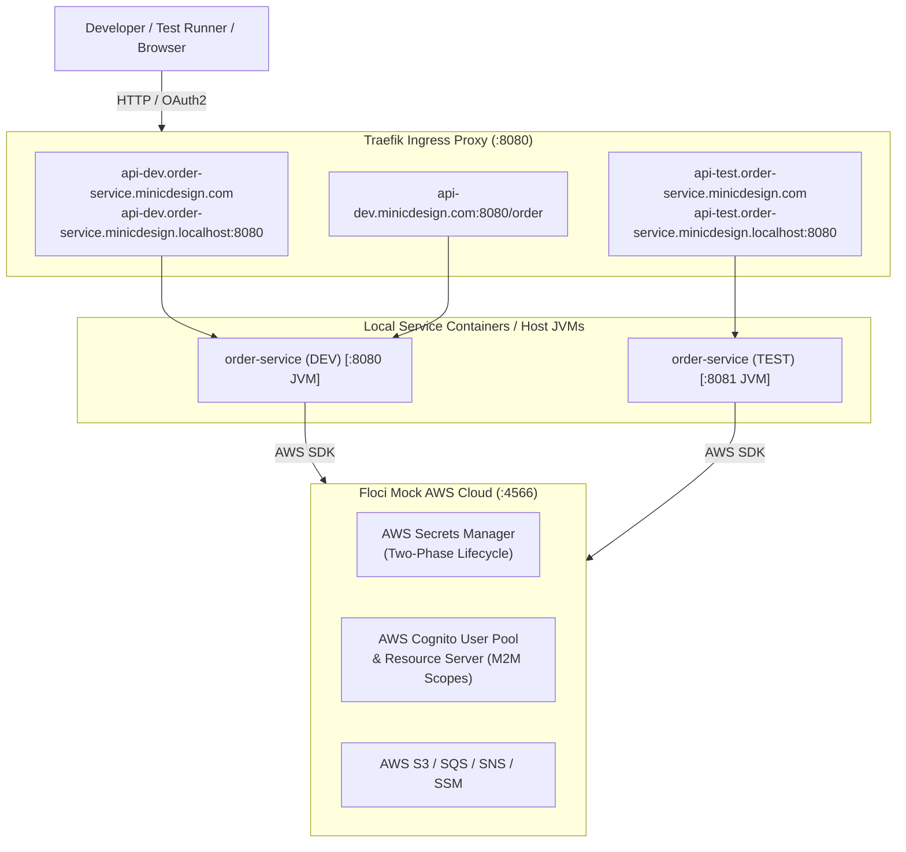
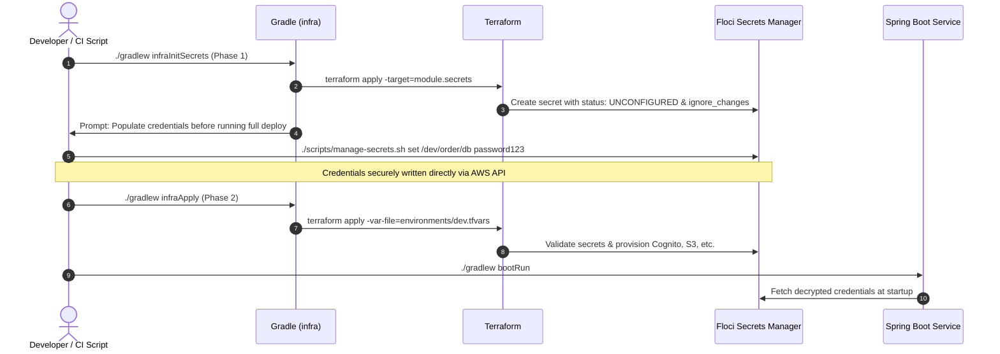

# Floci & Infrastructure as Code (IaC) Plugin

The **`com.minicdesign.infra`** plugin coordinates local "pseudo cloud" deployments for Java and Kotlin microservices. It combines **Floci** (an open-source, MIT-licensed Quarkus-native LocalStack drop-in replacement on port `4566`), **Traefik** (ingress proxy with multi-environment host routing on port `8080`), **Terraform / OpenTofu** (declarative AWS infrastructure), and automated **Cognito M2M OAuth2 / OpenAPI scope synchronization**.

---

## 1. Architectural Overview



---

## 2. Directory Layout Convention

When applied to a service, all infrastructure files are co-located in the `<service>/infra` directory:

```text
<service>/
  ├── contracts/
  │   └── openapi/
  │       └── api-v1.yaml
  ├── infra/
  │   ├── build.gradle.kts                   <-- Applies com.minicdesign.infra
  │   ├── docker/
  │   │   ├── docker-compose.yml             <-- Floci + Traefik definitions
  │   │   └── ingress/
  │   │       └── traefik.yml                <-- Dynamic host/path routing rules
  │   ├── terraform/
  │   │   ├── provider.tf                    <-- AWS provider pointing to http://localhost:4566
  │   │   ├── variables.tf                   <-- Environment, service_name, oauth_scopes
  │   │   ├── main.tf                        <-- Root module wiring
  │   │   ├── environments/
  │   │   │   ├── dev.tfvars
  │   │   │   └── test.tfvars
  │   │   └── modules/
  │   │       ├── secrets/
  │   │       │   └── main.tf                <-- Placeholder secrets with ignore_changes
  │   │       └── security/
  │   │           └── cognito.tf             <-- Cognito User Pool & Resource Server
  │   └── scripts/
  │       ├── manage-secrets.sh              <-- Secure out-of-band secret setter
  │       ├── setup-hosts.sh                 <-- Automated /etc/hosts helper
  │       └── bootstrap-remote-floci.sh      <-- Remote Linux server bootstrap helper
  └── src/
```

---

## 3. Configuration Extension (`infra`)

Configure the plugin in your `infra/build.gradle.kts` (or root `build.gradle.kts`):

```kotlin
plugins {
    id("com.minicdesign.infra")
}

infra {
    environment.set("dev")                                  // Target environment: dev, test, staging
    serviceName.set("order-service")                        // Service identifier used for routing & naming
    domainName.set("minicdesign.com")                       // Top-level domain for host routing
    flociPort.set(4566)                                     // Floci AWS mock port (default: 4566)
    ingressPort.set(8080)                                   // Traefik ingress port (default: 8080)
    flociHost.set("localhost")                              // Floci host (IP or domain; default: localhost)
    flociEndpoint.set("http://localhost:4566")              // Complete endpoint URL (default: http://${flociHost}:${flociPort})
    ingressHost.set("localhost")                            // Traefik ingress host (default: localhost)
    remoteServer.set(false)                                 // When true, skips local Docker Compose startup
    sshTarget.set("user@remote-server.lab")                 // Optional SSH target for port forwarding tunnels
    terraformDir.set(file("terraform"))                     // Directory containing Terraform code
    dockerComposeDir.set(file("docker"))                    // Directory containing docker-compose.yml
    syncOpenApiScopes.set(true)                             // Auto-sync OpenAPI scopes to Cognito
    persistentState.set(true)                               // Persist Floci state across restarts
    secretsModule.set("module.secrets")                     // Module target for Phase 1 secret init
    dockerPath.set("docker")                                // Path to docker binary
    terraformPath.set("terraform")                          // Path to terraform / tofu binary
    awsPath.set("aws")                                      // Path to aws cli binary
}
```

### Property Reference

| Property | Type | Default | Description |
| :--- | :--- | :--- | :--- |
| `environment` | `Property<String>` | `"dev"` | Active environment tier (matches `.tfvars` file). |
| `serviceName` | `Property<String>` | `project.name` | Unique service name for DNS routers, Cognito resource servers, and secret paths. |
| `domainName` | `Property<String>` | `"minicdesign.com"` | Base domain for multi-environment routing rules. |
| `flociPort` | `Property<Int>` | `4566` | Port where Floci listens for AWS service calls. |
| `ingressPort` | `Property<Int>` | `8080` | Port where Traefik routes inbound HTTP requests. |
| `flociHost` | `Property<String>` | `"localhost"` | Host where Floci AWS emulator runs (e.g. `"10.0.1.50"` or `"floci.lab"`). |
| `flociEndpoint` | `Property<String>` | `http://$flociHost:$flociPort` | Complete endpoint URL used by Terraform and tasks. |
| `ingressHost` | `Property<String>` | `"localhost"` | Host where Traefik ingress router runs. |
| `remoteServer` | `Property<Boolean>` | `false` | When `true`, skips local Docker Compose and tests remote health directly. |
| `sshTarget` | `Property<String>` | `null` | SSH connection destination for forwarding tunnels (e.g. `"deploy@remote.lab"`). |
| `terraformDir` | `DirectoryProperty` | `infra/terraform` or `terraform` | Location of Terraform scripts and modules. |
| `dockerComposeDir` | `DirectoryProperty` | `infra/docker` or `docker` | Location of `docker-compose.yml` and Traefik config. |
| `syncOpenApiScopes` | `Property<Boolean>` | `true` | Extract OAuth2 scopes from OpenAPI contracts before Terraform apply. |
| `persistentState` | `Property<Boolean>` | `true` | Retain Floci mock cloud storage across restarts. |
| `secretsModule` | `Property<String>` | `"module.secrets"` | Terraform module target for Phase 1 partial provisioning. |
| `dockerPath` | `Property<String>` | `"docker"` | Executable path for Docker CLI. |
| `terraformPath` | `Property<String>` | `"terraform"` | Executable path for Terraform or OpenTofu. |
| `awsPath` | `Property<String>` | `"aws"` | Executable path for AWS CLI. |

---

## 4. Gradle Tasks & Lifecycle

| Task | Group | Description | Dependencies |
| :--- | :--- | :--- | :--- |
| **`flociStart`** | `infra` | Starts local Docker Compose or verifies remote Floci cloud health. | None |
| **`flociStatus`** | `infra` | Prints health and active cloud services running in Floci (local or remote). | None |
| **`flociStop`** | `infra` | Shuts down local Floci and Traefik containers. | None |
| **`infraConfigureHosts`** | `infra` | Checks `/etc/hosts` and prints DNS alias helpers and zero-config RFC 6761 URLs. | None |
| **`infraTunnel`** | `infra` | Displays or launches an encrypted SSH port forwarding tunnel to an external Floci server. | None |
| **`syncOpenApiScopes`** | `infra` | Extracts `securitySchemes` scopes from OpenAPI specs and generates `scopes.auto.tfvars.json`. | None |
| **`infraInitSecrets`** | `infra` | Phase 1 partial deployment: applies only `-target=module.secrets` and checks secret status. | `flociStart` |
| **`infraApply`** | `infra` | Phase 2 full Terraform apply using the active environment's `.tfvars`. | `flociStart`, `syncOpenApiScopes`, `infraInitSecrets` |
| **`infraDeploy`** | `infra` | Master orchestrator: runs `flociStart` -> `syncOpenApiScopes` -> `infraInitSecrets` -> `infraApply`. | All above |
| **`infraDestroy`** | `infra` | Destroys all cloud infrastructure in Floci via `terraform destroy`. | None |

---

## 5. Host Routing & Multi-Environment Aliases

Traefik dynamically routes incoming traffic to the appropriate service instance based on the **Host Header** or **URL Path**:

### A. Zero-Configuration RFC 6761 `*.localhost` (Recommended)
All modern operating systems and browsers resolve any domain ending with `.localhost` to `127.0.0.1` without requiring `/etc/hosts` edits or root privileges:
- **DEV**: `http://api-dev.order-service.minicdesign.localhost:8080/orders`
- **TEST**: `http://api-test.order-service.minicdesign.localhost:8080/orders`

### B. Custom Corporate Domain Aliases
To simulate production cloud DNS domains (e.g. `api-dev.order-service.minicdesign.com`):
Run `./infra/scripts/setup-hosts.sh` or add the entry to `/etc/hosts`:
```text
127.0.0.1 api-dev.order-service.minicdesign.com api-test.order-service.minicdesign.com
```

### C. Path-Based Routing
Accessing the central domain with a service prefix routes directly to that service's dev instance:
- `http://api-dev.minicdesign.com:8080/order-service/...`

---

## 6. Two-Phase Secret Management Lifecycle

To satisfy strict security guidelines where passwords, API keys, and credentials must **never** be checked into version control or leaked into Terraform state:



1. **Phase 1 (`infraInitSecrets`)**:
   - Deploys only the secrets module (`-target=module.secrets`).
   - Creates the AWS Secrets Manager resource with an `UNCONFIGURED` placeholder payload.
   - Terraform lifecycle contains `ignore_changes = [secret_string]`, guaranteeing subsequent Terraform applies will **never overwrite** or expose values.
2. **Out-of-band Population**:
   - Insert secrets manually or via pipeline script using the AWS CLI or `scripts/manage-secrets.sh`:
     ```bash
     ./infra/scripts/manage-secrets.sh set /dev/order-service/database '{"username":"app_user","password":"MySecretPassword!"}'
     ```
3. **Phase 2 (`infraApply` / `infraDeploy`)**:
   - Verifies the secret status is no longer `UNCONFIGURED` and deploys the rest of the infrastructure.

---

## 7. Machine-to-Machine (M2M) Security & Cognito Scopes

Server-to-server calls authenticate using OAuth2 Client Credentials grant with AWS Cognito User Pools and Resource Servers.

1. **Scope Declaration in OpenAPI**:
   Define scopes directly in your OpenAPI specification (`contracts/openapi/*.yaml`):
   ```yaml
   components:
     securitySchemes:
       oauth2:
         type: oauth2
         flows:
           clientCredentials:
             tokenUrl: https://auth.minicdesign.com/oauth2/token
             scopes:
               orders:read: Read order details
               orders:write: Create and cancel orders
   ```
2. **Automated Synchronization (`syncOpenApiScopes`)**:
   - The plugin extracts all scopes from OpenAPI files and writes `infra/terraform/scopes.auto.tfvars.json`.
3. **Terraform Cognito Provisioning**:
   - The security module registers the custom scopes on the Cognito Resource Server:
   ```hcl
   resource "aws_cognito_resource_server" "service_api" {
     user_pool_id = aws_cognito_user_pool.m2m_pool.id
     identifier   = var.service_name
     name         = "${var.service_name} API"

     dynamic "scope" {
       for_each = var.oauth_scopes
       content {
         scope_name        = scope.value.name
         scope_description = scope.value.description
       }
     }
   }
   ```
4. **M2M Token Retrieval**:
   Downstream client services request access tokens via Floci Cognito on port 4566 using client credentials:
   ```bash
   curl -X POST http://localhost:4566/oauth2/token \
     -H "Content-Type: application/x-www-form-urlencoded" \
     -d "grant_type=client_credentials&client_id=<ID>&client_secret=<SECRET>&scope=order-service/orders:read"
   ```

---

## 8. Remote & External Server Deployment

Floci and Traefik can be hosted on a dedicated remote server (e.g., a shared team Linux box, CI/CD runner host, or cloud VM).

### A. Access Patterns

#### 1. SSH Port Forwarding Tunnel (Recommended Default - Zero Config)
You do not need to expose Floci to the network or change local URLs. Establish an encrypted tunnel forward:
```bash
# Using the plugin task:
./gradlew infraTunnel -Pconnect

# Or run manually in a terminal:
ssh -N -L 4566:localhost:4566 -L 8080:localhost:8080 user@remote-server.lab
```
With the tunnel active:
- Local tools and Terraform hit `http://localhost:4566` as normal.
- Local browsers hit `http://api-dev.order-service.minicdesign.localhost:8080` as normal.
- All AWS compute and Traefik routing execute remotely on the server.

#### 2. Corporate Mesh VPN (Tailscale / WireGuard)
If the server and developer laptops join a private VPN (e.g. Tailscale):
- Configure `infra { flociHost.set("floci-server.internal") }` in `build.gradle.kts`.
- Requests route directly over the encrypted mesh network.

#### 3. Wildcard Magic DNS (`*.nip.io`)
When accessing the server by its IP address on a local area network (LAN) without modifying `/etc/hosts`:
- Traefik automatically recognizes `.nip.io` hostnames:
  `http://api-dev.order-service.192.168.1.150.nip.io:8080` &rarr; routes directly to the dev instance.

### B. Bootstrapping Floci on the Remote Server

Copy the scaffolded `infra/` folder to the remote server and run:
```bash
./infra/scripts/bootstrap-remote-floci.sh
```
This script pulls Docker images, launches Floci on port 4566 and Traefik on port 8080, and checks health readiness.

### C. Configuring the Service for Remote Server Mode

In your `infra/build.gradle.kts`:
```kotlin
infra {
    remoteServer.set(true)                      // Skips local Docker Compose commands
    flociHost.set("floci-server.lab")          // Or IP address
    sshTarget.set("deploy@floci-server.lab")    // Enables ./gradlew infraTunnel
}
```
Run deployment commands from your workstation:
```bash
./gradlew infraDeploy
```
Terraform will automatically target `http://floci-server.lab:4566` using `var.floci_endpoint`.

