# Hexagonal Architecture Plugin

* **Plugin ID**: `com.minicdesign.hexagonal-architecture`
* **Implementation Class**: [`HexagonalArchitecturePlugin`](file:///Users/brankominic/dev/personal/build-logic/src/main/kotlin/com/minicdesign/buildlogic/hexagonal/HexagonalArchitecturePlugin.kt)
* **Configuration Extension**: [`HexagonalArchitectureExtension`](file:///Users/brankominic/dev/personal/build-logic/src/main/kotlin/com/minicdesign/buildlogic/hexagonal/HexagonalArchitectureExtension.kt) under `hexagonalArchitecture { ... }`

---

## Overview

The `HexagonalArchitecturePlugin` standardizes and enforces Ports and Adapters (Hexagonal Architecture) structure across services and monorepos. It provides two architectural modes for individual services, plus a first-class **Monorepo** configuration:

1. **Single-Module Configuration (`HexagonalMode.SINGLE_MODULE` — Default)**: For microservices organizing domain logic and adapters by package within a single Gradle project.
2. **Multi-Module Configuration (`HexagonalMode.MULTI_MODULE`)**: For services with physical Gradle subproject boundaries, with `contracts/` isolated as its own dedicated Gradle module.
3. **Monorepo Configuration (`monorepo.set(true)`)**: Manages multiple services under `services/` and shared libraries under `shared/`, supporting both single-module and multi-module services across the repository.

```mermaid
flowchart LR
        classDef adapter fill:#e3f2fd,stroke:#1565c0,stroke-width:2px;
        classDef core fill:#fff9c4,stroke:#fbc02d,stroke-width:2px;
        classDef port fill:#ffffff,stroke:#333333,stroke-width:1px,stroke-dasharray: 2 2;

        subgraph IN["Inbound Adapter"]
            CONTROLLER["REST Controller"]:::adapter
        end

        subgraph CORE["Application Core (The Hexagon)"]
            IN_PORT["Inbound Port<br/>(Driving Interface)"]:::port
            SERVICE["Domain Service<br/>& Entities"]:::core
            OUT_PORT["Outbound Port<br/>(Driven Interface)"]:::port

            IN_PORT -->|executes| SERVICE
            SERVICE -->|calls| OUT_PORT
        end

        subgraph OUT["Outbound Adapter"]
            REPO["Persistence Adapter<br/>(Spring Data JPA)"]:::adapter
        end

        %% Call Flow (Solid Green)
        CONTROLLER ==>|1. HTTP Request| IN_PORT
        OUT_PORT ==>|2. DB Query| REPO

        %% Compile-Time Dependencies (Dashed Red/Blue)
        CONTROLLER -.->|depends on| IN_PORT
        REPO -.->|implements DIP| OUT_PORT

        linkStyle 0,1 stroke:#2e7d32,stroke-width:2px;
        linkStyle 2 stroke:#2e7d32,stroke-width:2px;
        linkStyle 3 stroke:#2e7d32,stroke-width:2px;
        linkStyle 4 stroke:#c62828,stroke-width:2px,stroke-dasharray: 5 5;
        linkStyle 5 stroke:#c62828,stroke-width:2px,stroke-dasharray: 5 5;
```



---

## Architectural Configurations

### 1. Single-Module Configuration (Default)

In single-module mode, physical Gradle module separation is omitted in favor of clean internal package layering (governed in code by ArchUnit).

```
<service>/
  ├── src/
  │   ├── main/
  │   │   ├── java/com/example/service/
  │   │   │   ├── core/ (or domain/)       <-- Domain models, use-cases, port interfaces
  │   │   │   └── adapter/
  │   │   │       ├── in/                  <-- Web controllers, message listeners
  │   │   │       └── out/                 <-- Database repos, HTTP/REST clients
  │   │   └── resources/
  │   ├── test/
  │   └── testIntegration/                 <-- Integration tests
  ├── contracts/                           <-- API specifications: openapi, wsdl, proto, graphql
  └── wiremock/                            <-- WireMock stubs: mappings/ and __files/
```

* **Enforced**:
  - `contracts/` (or `contract/`) directory exists.
  - `wiremock/` directory exists.
  - `src/main` directory exists.

---

### 2. Multi-Module Configuration

In multi-module mode, physical boundaries are enforced via separate Gradle subprojects. **`contracts/` is its own dedicated Gradle module** where code generators run to produce clean DTOs and API interfaces. Inbound and outbound adapters depend downward on `contracts` and inward on `lib/core`.

```
<service>/
  ├── app/
  │   └── boot/             (Gradle module: main Spring Boot application)
  ├── contracts/            (Gradle module: API specifications & code generation)
  │   ├── build.gradle.kts
  │   ├── openapi/ (in/ and out/)
  │   ├── wsdl/    (in/ and out/)
  │   ├── proto/   (in/ and out/)
  │   └── graphql/ (in/ and out/)
  ├── lib/
  │   ├── core/             (Gradle module: domain logic & port interfaces)
  │   └── adapters/
  │       ├── in/
  │       │   └── <adapter> (Gradle module(s): inbound controllers/consumers)
  │       └── out/
  │           └── <adapter> (Gradle module(s): outbound clients/persistence)
  └── wiremock/             (WireMock stubs: mappings/ and __files/)
```

#### Why `contracts/` is its own module:
* **Decoupled Adapters**: Adapters depend on `:contracts` for generated DTOs/interfaces without depending on each other.
* **Isolates Generator Overhead**: Code generator plugins (OpenAPI, CXF, Protobuf, DGS) and compiler plugins run exclusively in `:contracts`.
* **Reusability & Publishing**: The `:contracts` module can easily be published as a client library (`<service>-contracts.jar`) for consumer microservices without leaking adapter or domain logic.

#### Package Encapsulation & Closure Strategy:
In multi-module hexagonal services, package closing and encapsulation are achieved through a three-tier model:
1. **Physical Module Boundaries (Gradle)**:
   - `lib/core` has zero dependencies on `app/boot` or `lib/adapters/*`. The Java compiler prevents core domain logic from referencing Spring MVC or database drivers.
   - Adapters (`lib/adapters/in/*` and `lib/adapters/out/*`) depend downward on `contracts` and inward on `lib/core`, but never on each other.
2. **Ports vs. Internal Organization (`lib/core`)**:
   - `ports/in/`: Public interfaces defining inbound use cases.
   - `ports/out/`: Public interfaces defining outbound SPIs (repositories, external clients).
   - `internal/`: Domain service implementations and helper classes.
3. **Build-Time Package Closure (ArchUnit)**:
   - Applying `com.minicdesign.archunit` with `restrictInternalPackages.set(true)` enforces that classes in `..internal..` packages cannot be accessed from outside.
   - This provides the strong encapsulation of JPMS (`module-info.java`) without any of its runtime reflection friction in Spring Boot.
4. **Standalone Shared Libraries (JPMS)**:
   - For standalone libraries in `shared/` distributed outside Spring Boot, `javaConventions { modular.set(true) }` enables native Java 9+ module-path inference for `module-info.java`.

---

### 3. Monorepo Configuration (`monorepo.set(true)`)

For repositories housing multiple microservices and shared reusable libraries, enable monorepo mode on the root project:

```
<monorepo-root>/
  ├── services/
  │   ├── order-service/           <-- Microservice (single- or multi-module layout)
  │   └── customer-service/        <-- Microservice (single- or multi-module layout)
  ├── shared/
  │   ├── common-domain/           (Gradle module: contains build.gradle[.kts])
  │   │   ├── build.gradle.kts
  │   │   └── src/main/java
  │   └── common-security/         (Gradle module: contains build.gradle[.kts])
  │       ├── build.gradle.kts
  │       └── src/main/java
  └── wiremock/                    (Optional monorepo-wide shared WireMock stubs)
```

#### Monorepo Features:
* **`services/` Directory**: Every subdirectory under `services/` is treated as a hexagonal service and checked according to `mode` (or per-service override via `serviceModes`).
* **`shared/` Directory**: Every subdirectory directly under `shared/` must be a valid Gradle module with its own `build.gradle` or `build.gradle.kts`. Stray unconfigured directories are flagged.
* **Supports Both Modes**: Monorepos can standardise on `SINGLE_MODULE` or `MULTI_MODULE`, or support a mix of both using `serviceModes.put("service-name", HexagonalMode.MULTI_MODULE)`.
* **Monorepo WireMock Discovery**: Subproject integration tests automatically discover and merge stubs from both their local service (`services/<service>/wiremock/`) and the root monorepo (`wiremock/`).

---

## WireMock Search & Resource Integration

Across single-module, multi-module, and monorepo configurations:
1. **Source Set Resource Injection**:
   The service's `wiremock/` directory (and monorepo root `wiremock/` in monorepo mode) is automatically added as a resource root to the `testIntegration` source set:
   ```kotlin
   sourceSets["testIntegration"].resources.srcDir("wiremock")
   ```
2. **Integration Test System Properties**:
   The `integrationTest` task (and `testIntegration` alias) receives the following system properties:
   - `wiremock.root-dir`: Absolute path to primary WireMock directory (service `wiremock/`).
   - `wiremock.dir`: Alias for `wiremock.root-dir`.
   - `wiremock.search-dirs`: Comma-delimited list of all candidate WireMock directories (service `wiremock/`, monorepo `wiremock/`, and module `src/testIntegration/resources/wiremock`).

---

## How to Apply

### Standalone Service `build.gradle.kts`
```kotlin
plugins {
    id("com.minicdesign.hexagonal-architecture")
}

hexagonalArchitecture {
    mode.set(HexagonalMode.SINGLE_MODULE) // or MULTI_MODULE
}
```

### Monorepo Root `build.gradle.kts`
```kotlin
plugins {
    id("com.minicdesign.hexagonal-architecture")
}

hexagonalArchitecture {
    monorepo.set(true)
    mode.set(HexagonalMode.SINGLE_MODULE) // default for services

    // Optional: override mode for specific services
    serviceModes.put("billing-service", HexagonalMode.MULTI_MODULE)
}
```

---

## Configuration Reference

Configure the `hexagonalArchitecture` extension:

```kotlin
import com.minicdesign.buildlogic.hexagonal.HexagonalMode

hexagonalArchitecture {
    // Mode for services: SINGLE_MODULE (default) or MULTI_MODULE
    mode.set(HexagonalMode.SINGLE_MODULE)

    // Root directory of the service / monorepo (default: layout.projectDirectory)
    serviceDir.set(layout.projectDirectory)

    // Enable monorepo layout (services/ and shared/)
    monorepo.set(false)

    // In monorepo mode, customize directories
    servicesDir.set(layout.projectDirectory.dir("services"))
    sharedDir.set(layout.projectDirectory.dir("shared"))
    enforceServices.set(true)
    enforceShared.set(true)

    // Per-service mode overrides in monorepo mode
    serviceModes.put("order-service", HexagonalMode.MULTI_MODULE)

    // Contracts & WireMock options:
    enforceContracts.set(true)
    contractsAsModule.set(true) // MULTI_MODULE only
    enforceWiremock.set(true)

    // Multi-module subproject options:
    enforceAppBoot.set(true)
    enforceCore.set(true)
    enforceAdapters.set(true)
    requireInboundAdapters.set(false)
    requireOutboundAdapters.set(false)

    // Fail the build if violations are found (default: true)
    failOnViolation.set(true)
}
```

### Parameters Summary

| Property | Type | Default Value | Description |
| :--- | :--- | :--- | :--- |
| `mode` | `Property<HexagonalMode>` | `HexagonalMode.SINGLE_MODULE` | Architectural configuration mode: `SINGLE_MODULE` or `MULTI_MODULE`. |
| `monorepo` | `Property<Boolean>` | `false` | Enables monorepo layout with `services/` and `shared/` directories. |
| `serviceDir` | `DirectoryProperty` | `layout.projectDirectory` | Root directory of the hexagonal service or monorepo to validate. |
| `servicesDir` | `DirectoryProperty` | `serviceDir.dir("services")` | Directory containing microservices in monorepo mode. |
| `sharedDir` | `DirectoryProperty` | `serviceDir.dir("shared")` | Directory containing shared library modules in monorepo mode. |
| `enforceServices` | `Property<Boolean>` | `true` | In monorepo mode, validates `services/` directory exists. |
| `enforceShared` | `Property<Boolean>` | `true` | In monorepo mode, validates `shared/` directory exists and subdirectories are Gradle modules. |
| `serviceModes` | `MapProperty<String, HexagonalMode>` | `[:]` | In monorepo mode, per-service override for `HexagonalMode`. |
| `enforceContracts` | `Property<Boolean>` | `true` | Validates `contracts/` (or `contract/`) directory exists. |
| `contractsAsModule` | `Property<Boolean>` | `true` | In `MULTI_MODULE` mode, validates that `contracts/` is a Gradle module. |
| `enforceWiremock` | `Property<Boolean>` | `true` | Validates `wiremock/` directory exists. |
| `enforceAppBoot` | `Property<Boolean>` | `true` | In `MULTI_MODULE` mode, validates `app/boot` exists and has `build.gradle[.kts]`. |
| `enforceCore` | `Property<Boolean>` | `true` | In `MULTI_MODULE` mode, validates `lib/core` exists and has `build.gradle[.kts]`. |
| `enforceAdapters` | `Property<Boolean>` | `true` | In `MULTI_MODULE` mode, validates `lib/adapters/in` and `lib/adapters/out` layout. |
| `requireInboundAdapters` | `Property<Boolean>` | `false` | When `true`, requires at least one adapter module in `lib/adapters/in/`. |
| `requireOutboundAdapters` | `Property<Boolean>` | `false` | When `true`, requires at least one adapter module in `lib/adapters/out/`. |
| `failOnViolation` | `Property<Boolean>` | `true` | Fails build (`GradleException`) on violation; if `false`, logs warning. |

---

## Available Tasks

| Task | Group | Description |
| :--- | :--- | :--- |
| `checkHexagonalArchitecture` | `verification` | Inspects directory structure and module configuration against the configured mode (and monorepo layout). Automatically hooked into lifecycle `check`. |
| `scaffoldHexagonalArchitecture` | `build setup` | General scaffolding wizard: checks project mode and prompts for module name, base package, and contract types. |
| `scaffoldService` | `build setup` | Scaffolds a new hexagonal service module with interactive prompts. |
| `scaffoldSharedLibrary` | `build setup` | Scaffolds a new shared library module in a monorepo with interactive prompts. |
| `scaffoldAdapter` | `build setup` | Scaffolds a new hexagonal adapter module (`in` or `out`) with interactive prompts. |

---

## Interactive Scaffolding Prompts

When running any scaffolding task interactively in a terminal, the wizard inspects the active project mode and asks:

1. **Module Name**:
   - Prompts for the module name (e.g. `order-service`, `common-models`, or `web`).
   - CLI flags: `-Pname=<name>` or `-PmoduleName=<name>`
2. **Base Package**:
   - Defaults to `<projectBasePackage>.<directory>.<moduleNameSanitized>`.
     - Monorepo Service: `com.example.services.orderservice`
     - Monorepo Shared Lib: `com.example.shared.commonmodels`
     - Multi-Module Adapter: `com.example.services.orderservice.adapters.in.web`
   - CLI flags: `-Ppackage=<package>` or `-PbasePackage=<package>`
3. **Contract Types**:
   - Prompts for a comma-separated list of contract types:
     ```text
     Contract types (options: openapi, wsdl, grpc, graphql) [openapi]:
     ```
   - **Behavior**:
     - Supported options: `openapi`, `wsdl`, `grpc`, `graphql`.
     - Any misspelled options are safely ignored, creating contract directories for the remaining valid types.
     - If blank or no valid types provided, defaults to `openapi`.
     - In multi-module mode, automatically generates `contracts/build.gradle.kts` applying the corresponding generator plugins (`openapi-codegen`, `cxf-codegen`, `grpc-codegen`, `graphql-codegen`).
   - CLI flags: `-Pcontracts=<types>` or `-PcontractTypes=<types>`
4. **Generator Output Packages (individually per requested generator)**:
   - **OpenAPI**:
     - Prompts: `Enter output package for OpenAPI generator [<basePackage>.api]: `
     - Configures in `build.gradle.kts`:
       ```kotlin
       openapiCodegen {
           openApiBasePackage.set("<chosen-package>")
       }
       ```
     - CLI flag: `-PopenapiPackage=<package>`
   - **WSDL (CXF)**:
     - Prompts: `Enter output package for WSDL generator [<basePackage>.soap]: `
     - Configures in `build.gradle.kts`:
       ```kotlin
       cxfCodegen {
           wsdlBasePackage.set("<chosen-package>")
       }
       ```
     - CLI flag: `-PwsdlPackage=<package>`
   - **GraphQL**:
     - Prompts: `Enter output package for GraphQL generator [<basePackage>.graphql]: `
     - Configures in `build.gradle.kts`:
       ```kotlin
       graphqlCodegen {
           packageName.set("<chosen-package>")
       }
       ```
     - CLI flag: `-PgraphqlPackage=<package>`
   - **gRPC (Protobuf)**:
     - **Omitted from interactive package prompt**: Protobuf/gRPC packages are configured directly inside `.proto` contracts rather than in Gradle build scripts.
     - **Build script documentation**: A clear guidance comment is automatically injected into `build.gradle.kts`:
       ```kotlin
       // NOTE for gRPC: The output package is configured directly in your .proto file(s)
       // using: option java_package = "com.yourcompany.package";
       // Check and alter your .proto file(s) under contracts/proto/ to configure the generated output package.
       ```
     - **Starter Contract**: Creates `contracts/grpc/in/sample.proto` with preconfigured `option java_package = "<basePackage>.grpc";` and instructions.

### CLI Examples

```bash
# Interactive wizard (prompts for module name, package, contracts, and output packages)
./gradlew scaffoldHexagonalArchitecture

# Scaffold a specific service non-interactively with customized generator packages
./gradlew scaffoldService \
    -Pname=payment-service \
    -Ppackage=com.company.payment \
    -Pcontracts="openapi, grpc" \
    -PopenapiPackage=com.company.payment.api

# Scaffold a shared library module
./gradlew scaffoldSharedLibrary -Pname=common-security -Ppackage=com.company.security

# Scaffold an inbound adapter in a multi-module service
./gradlew scaffoldAdapter -Pservice=order-service -PadapterType=in -Pname=web-rest -Pcontracts=openapi
```
